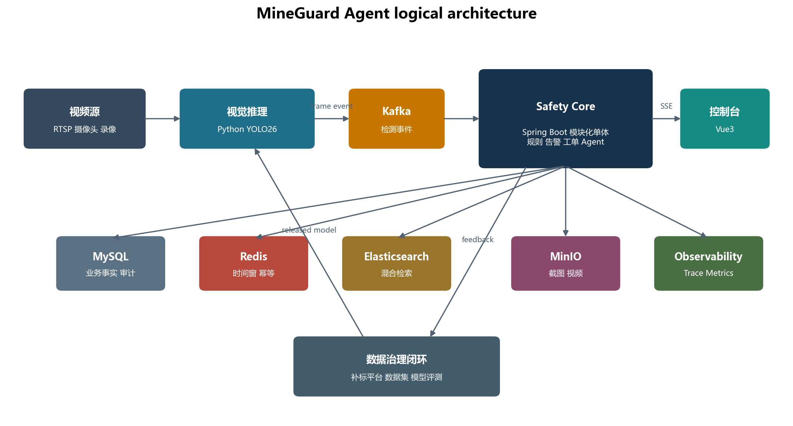
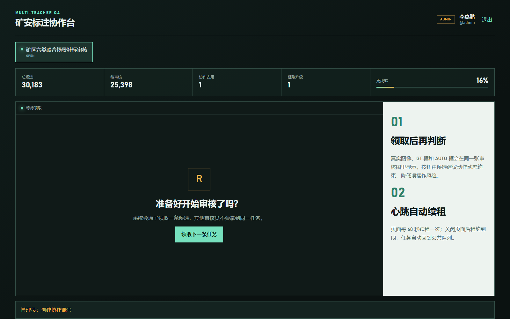
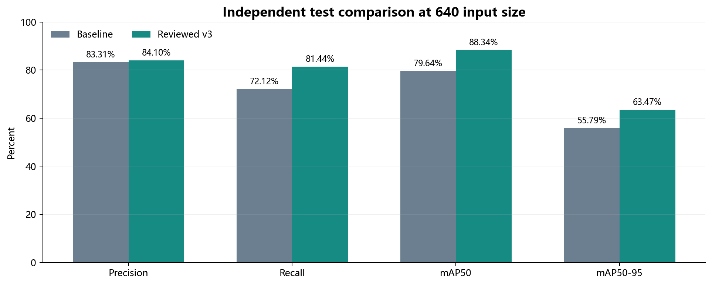

# MineGuard Agent

[](https://github.com/jiapengLi11/mine-safety-agent-platform/actions/workflows/ci.yml)


[](LICENSE)

**An evidence-first mining-safety monitoring and controlled incident-response platform.**

MineGuard connects YOLO-based visual perception, deterministic temporal rules, evidence-grounded RAG, a constrained AI agent, human approval, work orders, and model feedback. It is being built as a reproducible engineering system rather than a collection of disconnected demos.

[中文说明](README.zh-CN.md) | [System handbook](docs/矿区智能安全监控与处置平台系统设计与开发手册_v1.0.md) | [Agent evaluation](evals/README.md) | [VM deployment](deploy/VM_DEPLOYMENT.md) | [Development status](docs/DEVELOPMENT_STATUS.md)

> Project status: **Phase 1 in progress.** The backend foundation, domain rules, database baseline, tests, and VM deployment are implemented. Kafka ingestion, RTSP inference, work orders, RAG, Agent workflows, and the Vue console are roadmap items, not completed claims.

## Why this project exists

A detector output is not yet a safety incident. A usable system must answer harder engineering questions:

- How do we prevent a single unstable frame from becoming a false alarm?
- How do we preserve frame time, model version, evidence, and every later decision?
- Which actions can an LLM propose, and which actions must deterministic code or a human approve?
- How do online monitoring and offline data governance improve each other without becoming tightly coupled?

MineGuard addresses these questions with explicit event contracts, temporal aggregation, state machines, transactional consistency, auditable evidence, and controlled tool execution.

## Architecture



| Unit | Technology | Responsibility |
|---|---|---|
| Vision inference | Python, YOLO26, OpenCV, FastAPI | RTSP/local-video ingestion, frame sampling, inference, same-frame annotation, event publishing |
| Safety core | Java, Spring Boot, Spring Modulith | Devices, rules, alerts, work orders, RAG, Agent policy, authorization, audit |
| Web console | Vue 3, TypeScript, Element Plus | Monitoring, alert evidence, approvals, work orders, administration |

The first release deliberately starts as a modular monolith. Module boundaries are verified in tests, while Kafka is reserved for the high-volume detection boundary and reliable external events.

## Implemented now

| Capability | Evidence in this repository |
|---|---|
| Versioned detection event contract | Java immutable domain records, JSON Schema, example payload |
| Temporal alert rule | Sliding window, confidence threshold, event idempotency, camera isolation, cooldown |
| Alert lifecycle | Guarded aggregate state transitions and illegal-transition tests |
| Database baseline | Flyway schema for detections, alerts, explicit Outbox, and audit logs |
| Modular architecture | Spring Modulith and an architecture verification test |
| Reproducible packaging | Spring Boot executable JAR and multi-stage Dockerfile |
| Real VM deployment | Isolated MySQL account/schema, authenticated Redis, systemd user service, health endpoint |
| Automated verification | 11 passing tests and GitHub Actions CI |
| Agent evaluation foundation | Versioned Goldens, deterministic safety gates, Harness Evals adapter, local Qwen/OpenAI-compatible targets, JSON/Markdown/HTML evidence |

### Deliberate design choices

1. **Deterministic logic before LLM reasoning.** Thresholds, time windows, permissions, state transitions, and tool execution remain normal code.
2. **One reliable-event mechanism.** MineGuard owns an explicit `outbox_events` table instead of enabling a second JPA event store.
3. **Event time over display time.** Rules use the frame capture timestamp so UI and streaming delay cannot change incident semantics.
4. **Online and training paths stay separate.** Only registered model versions enter the online service; hard samples return through a versioned feedback path.
5. **Truthful scope.** The design targets multi-camera operation, but no production-scale 20-stream throughput claim is made before a repeatable load test exists.

## Detection event contract

The inference service and Java backend communicate through a versioned frame event:

```json
{
  "eventId": "01K50MINEGUARD000000000001",
  "schemaVersion": 1,
  "traceId": "trace-cam-001-1726156800000",
  "cameraId": "CAM-001",
  "frameId": 182734,
  "capturedAt": "2026-09-12T12:00:00.000Z",
  "inferredAt": "2026-09-12T12:00:00.076Z",
  "modelVersion": "company-reviewed-v3-yolo26m",
  "imageWidth": 1920,
  "imageHeight": 1080,
  "objects": [{
    "className": "smoking",
    "confidence": 0.83,
    "box": { "x1": 812.0, "y1": 224.0, "x2": 936.0, "y2": 391.0 }
  }]
}
```

See the complete [JSON Schema](contracts/detection-frame-event-v1.schema.json) and [example](contracts/examples/detection-frame-event-v1.json).

## Temporal rule example

The first rule prototype models "smoking detected at least three times within 20 seconds":

```text
matching frame
  -> validate class and confidence
  -> deduplicate by eventId
  -> group by ruleId + cameraId
  -> remove hits older than capturedAt - 20s
  -> trigger when distinct hit count >= 3
  -> suppress repeated alerts during cooldown
```

This turns noisy frame predictions into a stable business signal. The in-memory implementation is an executable domain prototype; Redis-backed atomic windows are the next integration step.

## Verified model and data-governance foundation

MineGuard builds on a completed offline label-recovery workflow. Six single-class teachers scanned 29,071 images for 174,426 model-image inference operations, producing 99,696 prediction evidence rows and 30,183 human-review tasks. Those figures describe the upstream data-governance project, not work performed by this new backend.

The real multi-user review console below is retained as the upstream human-in-the-loop subsystem. It uses image-level task leasing so reviewers cannot edit different boxes from the same image concurrently.



On an independent 4,359-image test split at input size 640, the reviewed YOLO26m model improved recall by 9.32 percentage points, mAP50 by 8.70 points, and mAP50-95 by 7.67 points over the recorded baseline.



| Metric | Baseline | Reviewed v3 | Change |
|---|---:|---:|---:|
| Precision | 83.31% | 84.10% | +0.79 pp |
| Recall | 72.12% | 81.44% | +9.32 pp |
| mAP50 | 79.64% | 88.34% | +8.70 pp |
| mAP50-95 | 55.79% | 63.47% | +7.67 pp |

## Build and verify

Prerequisites: JDK 17 or newer and Maven 3.9 or newer.

```powershell
Set-Location -LiteralPath 'E:\project11\mine-safety-agent-platform'
mvn clean verify
```

Expected current result: `11` tests, `0` failures, followed by an executable JAR at `backend/target/mineguard-backend-0.1.0-SNAPSHOT.jar`.

## Agent evaluation and release gate

The repository now includes an executable domain benchmark for the future RAG/Agent boundary. It checks structured-output validity, risk and decision preservation, high-risk escalation, evidence provenance, exact typed-tool plans, forbidden tools, prompt injection and latency. The deterministic rule target validates benchmark wiring in CI; local Qwen and OpenAI-compatible targets evaluate real candidate models without granting them execution authority.

```powershell
powershell -ExecutionPolicy Bypass -File .\evals\run-evals.ps1 -Target rule -Profile ci -EnforceGate
powershell -ExecutionPolicy Bypass -File .\evals\run-evals.ps1 -Target qwen -Profile candidate-model
```

An RTX 3060 run of Qwen3-0.6B passed risk, decision, citation, high-risk recall and injection checks, but failed the candidate release gate because of extra tools on `OBSERVE/IGNORE` cases and one missing required field. This negative result is retained deliberately: correct prose does not imply a safe execution plan. See the [full evaluation guide](evals/README.zh-CN.md) and [machine-readable summary](docs/evaluation/qwen3-0.6b-3060-summary.json).


## VM deployment

The verified development deployment runs on an Ubuntu VMware guest. Docker Compose is the preferred path. Because that VM currently cannot resolve Docker Hub, the repository also includes an exercised offline JAR installer:

```powershell
powershell -ExecutionPolicy Bypass -File 'E:\vmware17.5.2\vm_control.ps1' -Action Start
Set-Location -LiteralPath 'E:\project11\mine-safety-agent-platform'
mvn clean verify
powershell -ExecutionPolicy Bypass -File .\deploy\install-offline-to-vm.ps1
Invoke-RestMethod http://192.168.1.110:18080/actuator/health
```

Real passwords are generated or imported only inside the VM and stored in a mode-600 environment file. The repository contains placeholders only. Kafka remains off until the first consumer is implemented.

## Repository layout

```text
mine-safety-agent-platform/
├── backend/                 Spring Boot modular-monolith backend
├── contracts/               Versioned cross-service event schemas
├── deploy/                  Docker and verified VMware deployment paths
├── docs/                    Design handbook, status, and real project figures
├── tools/                   Document-generation utilities
├── .github/workflows/       Continuous integration
└── pom.xml                  Maven reactor root
```

## Roadmap

- [x] Architecture baseline and domain skeleton
- [x] Detection contract, temporal-rule prototype, alert state machine
- [x] MySQL/Redis VM integration and persistent service deployment
- [ ] Detection persistence and Kafka consumer with replay tests
- [ ] Redis atomic sliding-window implementation
- [ ] Alert evidence, work-order lifecycle, and Outbox publisher
- [ ] Evidence-grounded RAG with retrieval evaluation
- [ ] Constrained Agent with typed tools and human approval
- [x] Domain Golden format, deterministic Agent gates, Harness Evals integration, and RTX 3060 candidate baseline
- [ ] Vue operations console and fixed-video demonstration
- [ ] Multi-stream load test with published hardware and workload assumptions

## Five-minute interview walkthrough

1. Start with the architecture figure and explain why a detector result is not directly an alert.
2. Open the event schema and show how `capturedAt`, `modelVersion`, `traceId`, and bounding boxes make decisions replayable.
3. Walk through `TemporalRuleEvaluatorTest` to explain idempotency, event-time windows, camera isolation, and cooldown.
4. Open the Flyway migration and explain inbound uniqueness, business state, Outbox consistency, and auditability.
5. Run `mvn clean verify`, then show the real VM health endpoint and discuss why an offline deployment fallback was necessary.
6. Close with the roadmap and clearly separate implemented evidence from future design.

## Documentation

- [Chinese system design and development handbook](docs/矿区智能安全监控与处置平台系统设计与开发手册_v1.0.md)
- [Word handbook](docs/矿区智能安全监控与处置平台系统设计与开发手册_v1.0.docx)
- [VM deployment and recovery procedure](deploy/VM_DEPLOYMENT.md)
- [Development status](docs/DEVELOPMENT_STATUS.md)

## Security and scope

- No RTSP credentials, database passwords, model weights, or private datasets are committed.
- The repository is an engineering portfolio and research prototype, not a certified safety system.
- High-risk Agent actions will require deterministic policy checks and explicit human approval.

## License

Released under the [MIT License](LICENSE).
