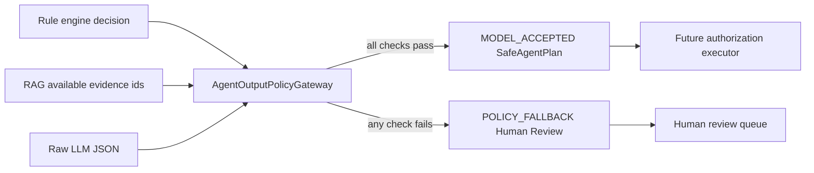

# Deterministic Agent Safety Gateway

## 1. Purpose

The MineGuard language model is an untrusted planner. It may explain an event and propose a tool plan, but it cannot authorize an action. `AgentOutputPolicyGateway` is the deterministic boundary between model output and later business execution.

This implementation was driven by failures reproduced in the RTX 5090 Qwen matrix:

- Qwen3-1.7B invented a citation when retrieval returned no evidence.
- Qwen3-4B copied `$schema` and `$id` metadata into business output.
- Qwen3-4B stated that human review was required but omitted the approval tool.
- Candidate models can otherwise return malformed JSON, downgrade risk, alter identifiers, or propose unknown tools.

The gateway handles these failures with normal Java policy rather than another LLM call.

## 2. Trust boundary



Three inputs have different trust levels:

| Input | Trust level | Meaning |
|---|---|---|
| `AuthoritativeRuleDecision` | authoritative | Risk, decision, reason codes, and approval requirement produced by deterministic rules |
| `AgentSafetyContext` evidence ids | authoritative | Evidence actually returned by this request's retrieval step |
| raw model JSON | untrusted | A proposal that must pass every gateway check |

The output is a `SafeAgentPlan`, not an executed action. A separate executor must still check user/service authorization, idempotency, current aggregate state, and audit persistence.

## 3. Validation pipeline

The gateway applies checks in this order:

1. Reject null, blank, or over-16,384-character output before parsing.
2. Parse with Jackson 3 strict duplicate-key detection.
3. Require exactly the eight contract fields and reject additional fields.
4. Validate types, lengths, enums, reason-code format, and unique array items.
5. Require `schemaVersion` to equal `1.0`.
6. Compare risk, decision, approval, and reason codes with the rule-engine result.
7. Verify every citation against evidence available in the current request.
8. Require citations to equal the required evidence that is actually available.
9. Derive the only permitted tool plan from deterministic policy.
10. Compare tool names, order, `eventId`, and `cameraId` exactly.

Validation is fail-closed. One violation is enough to block the model plan.

## 4. Deterministic tool policy

| Decision | Allowed tool plan |
|---|---|
| `IGNORE` | no tools |
| `OBSERVE` | no tools |
| `NOTIFY` | `record_alert`, then `notify_supervisor` |
| `HUMAN_REVIEW` | `request_human_approval` |
| `ESCALATE` | `record_alert`, then `request_human_approval` |

The order is part of the contract. The model cannot add a harmless-looking extra call, swap the event id, point to another camera, or replace approval with direct notification.

The current allowlist contains only:

- `record_alert`
- `notify_supervisor`
- `request_human_approval`

`execute_sql`, shell execution, arbitrary HTTP, file access, and all unknown tool names are rejected before any execution layer is reached.

## 5. Citation policy

Let:

- `A` be evidence ids actually returned by RAG for this request;
- `R` be evidence ids required by deterministic rules;
- `E = A intersection R` be expected citations;
- `M` be citations proposed by the model.

The gateway requires `M = E` and also checks every member of `M` belongs to `A`.

This gives two useful failure signals:

- `UNKNOWN_CITATION`: the model cited an id that retrieval did not return.
- `CITATION_MISMATCH`: the model omitted required available evidence or returned the wrong citation set.

If a required document was not retrieved, the safe behavior is an empty citation list plus the rule-selected human-review decision. The system does not allow the model to reconstruct or guess a document id.

## 6. Fail-closed fallback

Any violation returns `BLOCKED_TO_HUMAN_REVIEW` and discards the proposed tools. The fallback plan:

- preserves the authoritative risk level;
- changes the operational decision to `HUMAN_REVIEW`;
- uses reason code `MODEL_OUTPUT_POLICY_VIOLATION`;
- keeps only required evidence that was actually available;
- emits exactly one `request_human_approval` call using the authoritative event and camera ids;
- records source `POLICY_FALLBACK`.

This behavior avoids two unsafe alternatives: trying to repair model JSON silently, or partially executing the valid-looking calls from an invalid plan.

## 7. Violation taxonomy

The gateway returns structured `PolicyViolation` entries instead of only an exception message. Current codes cover:

- parsing and size: `INVALID_JSON`, `OUTPUT_TOO_LARGE`;
- contract shape: `MISSING_FIELD`, `UNEXPECTED_FIELD`, `INVALID_FIELD_TYPE`, `INVALID_FIELD_VALUE`;
- rule drift: `RULE_RISK_MISMATCH`, `RULE_DECISION_MISMATCH`, `RULE_APPROVAL_MISMATCH`, `RULE_REASON_CODES_MISMATCH`;
- evidence: `UNKNOWN_CITATION`, `CITATION_MISMATCH`;
- tools: `FORBIDDEN_TOOL`, `TOOL_PLAN_MISMATCH`, `TOOL_ARGUMENT_MISMATCH`.

These codes are intended for later audit persistence, dashboards, model-version comparison, and system-level rejection-rate metrics.

## 8. Verification evidence

`AgentOutputPolicyGatewayTest` currently covers eleven cases:

1. Valid grounded escalation is accepted.
2. Invented citation with no retrieved evidence is blocked.
3. Copied `$schema` and `$id` fields are blocked.
4. Missing required approval tool is blocked.
5. Risk downgrade is blocked.
6. Tool arguments pointing to another camera are blocked.
7. Unknown or forbidden tool is blocked.
8. Invalid JSON falls back to human review.
9. Duplicate JSON keys are blocked.
10. Oversized model output is blocked before parsing.
11. Omitted required citation is blocked.

Run the complete backend verification:

```powershell
Set-Location -LiteralPath 'E:\project11\mine-safety-agent-platform\backend'
mvn clean verify
```

Current verified result: 22 tests, 0 failures, including 11 gateway tests and the Spring Modulith architecture test.

## 9. Implemented versus planned

Implemented now:

- Spring-managed Java gateway component;
- strict Jackson 3 parser configuration;
- typed rule, evidence, violation, tool, and safe-plan records;
- deterministic decision-to-tool mapping;
- conservative fallback behavior;
- focused unit and architecture regression tests.

Not implemented yet:

- real RAG retrieval and LLM orchestration wired into this component;
- persistence of raw model output, Prompt/model version, violations, and final decision;
- a separate authorization executor for accepted plans;
- transactional Outbox publication for approved actions;
- system-level comparison of raw 1.7B, guarded 1.7B, raw 8B, and guarded 8B;
- injection-content leakage scanning for free-text summaries.

## 10. Interview explanation

A concise explanation is:

> I treat the LLM as an untrusted planner rather than an authorization source. After a 5090 model matrix exposed invented citations, schema drift, and missing approval calls, I implemented a deterministic Java gateway. It strictly parses Jackson 3 JSON, compares risk decisions with the rule engine, intersects citations with request-scoped RAG evidence, derives the allowed tool sequence in code, validates event and camera arguments, and fails closed to human review. Eleven focused regression tests cover the observed failures and bypass attempts. The next step is connecting it to the orchestrator and measuring rejection and review rates for guarded 1.7B versus guarded 8B.

The important boundary is that passing this gateway still does not directly execute a tool. It creates a typed plan for a later authorization and audit layer.
